# Frontend Architecture - Current State

## Overview

This document provides a comprehensive analysis of the current frontend architecture for the Lin application, a personal productivity dashboard built with React.

**Last Updated:** November 11, 2025  
**Framework:** React 19.1.0  
**Build Tool:** Create React App (react-scripts 5.0.1)  
**Styling:** Tailwind CSS 3.4.17 + Custom CSS

---

## Table of Contents

1. [High-Level Architecture](#high-level-architecture)
2. [Project Structure](#project-structure)
3. [Component Architecture](#component-architecture)
4. [State Management](#state-management)
5. [Data Flow](#data-flow)
6. [Routing & Navigation](#routing--navigation)
7. [API Integration](#api-integration)
8. [Styling Architecture](#styling-architecture)
9. [Current Design Patterns](#current-design-patterns)
10. [Technology Stack](#technology-stack)
11. [Identified Issues](#identified-issues)
12. [Architecture Diagrams](#architecture-diagrams)

---

## High-Level Architecture

The application follows a **monolithic component-based architecture** with centralized routing in the root App component.

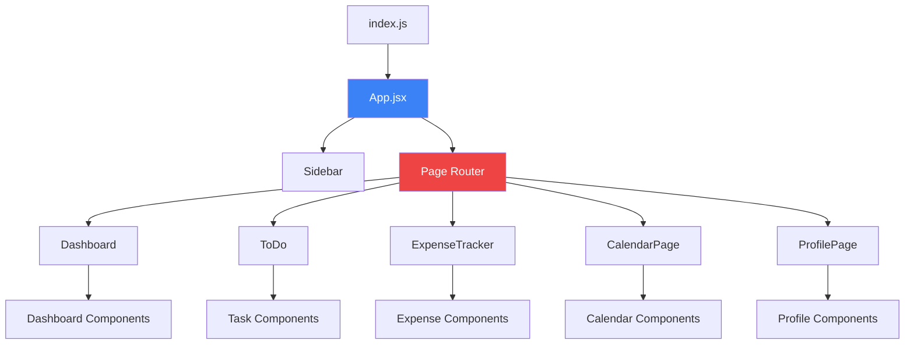


---

## Project Structure

```
frontend/lin/
├── public/                    # Static assets
│   ├── index.html
│   ├── favicon.ico
│   └── manifest.json
├── src/
│   ├── components/           # All React components
│   │   ├── CalendarPage/    # Calendar feature module
│   │   │   ├── CalendarPage.jsx
│   │   │   ├── CalendarHeader.jsx
│   │   │   ├── CalendarGrid.jsx
│   │   │   ├── EventModal.jsx
│   │   │   └── AddEventModal.jsx
│   │   ├── dashboard/       # Dashboard feature module
│   │   │   ├── Dashboard.jsx
│   │   │   ├── Sidebar.jsx
│   │   │   ├── MetricCard.jsx
│   │   │   ├── DashboardTotalExpense.jsx
│   │   │   ├── DashboardTaskCompletion.jsx
│   │   │   ├── DashboardConsistency.jsx
│   │   │   ├── DashboardUpcomingEvents.jsx
│   │   │   ├── TasksAndEvents.jsx
│   │   │   ├── TaskHeatmap.jsx
│   │   │   ├── ExpenseDashboard.jsx
│   │   │   ├── ExpenseInsights.jsx
│   │   │   ├── ThisWeeksEvents.jsx
│   │   │   └── TodaysTasks.jsx
│   │   ├── expenseTrack/    # Expense tracking module
│   │   │   └── ExpenseTracker.jsx (1300+ lines)
│   │   ├── ToDoList/        # Task management module
│   │   │   └── ToDo.jsx (500+ lines)
│   │   └── profile/         # User profile module
│   │       ├── ProfilePage.jsx
│   │       └── EditableField.jsx
│   ├── pages/               # Page-level components
│   │   └── AnalyticsPage.jsx
│   ├── App.jsx              # Root component & router
│   ├── index.js             # Application entry point
│   ├── index.css            # Global styles
│   └── logo.svg
├── package.json
├── tailwind.config.js
└── postcss.config.js
```

### Architectural Observations

**Strengths:**
- Feature-based component organization (dashboard, expenseTrack, CalendarPage)
- Separation of concerns at the folder level
- Consistent naming conventions

**Weaknesses:**
- No dedicated folders for: services, hooks, utils, contexts, types
- Large monolithic components (ExpenseTracker: 1300+ lines, ToDo: 500+ lines)
- Mixed concerns within components (UI + business logic + API calls)
- No shared component library (buttons, inputs, modals)

---

## Component Architecture

### Component Hierarchy

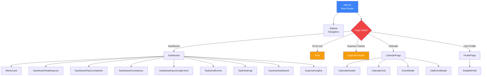

### Component Types

#### 1. **Container Components** (Smart Components)
Components that manage state and business logic:
- `App.jsx` - Root state & routing
- `Dashboard.jsx` - Dashboard orchestration
- `ExpenseTracker.jsx` - Expense management (1300+ lines)
- `ToDo.jsx` - Task management (500+ lines)
- `CalendarPage.jsx` - Calendar & events
- `ProfilePage.jsx` - User profile management

#### 2. **Presentational Components** (Dumb Components)
Components focused on UI rendering:
- `Sidebar.jsx` - Navigation UI
- `MetricCard.jsx` - Metric display
- `CalendarHeader.jsx` - Calendar navigation
- `CalendarGrid.jsx` - Calendar grid display
- `EditableField.jsx` - Editable input field

#### 3. **Modal Components**
- `EventModal.jsx` - View/edit event details
- `AddEventModal.jsx` - Create new event
- `ChatbotPanel` (inside ExpenseTracker) - AI assistant

#### 4. **Feature-Specific Components**
Dashboard widgets:
- `DashboardTotalExpense.jsx`
- `DashboardTaskCompletion.jsx`
- `DashboardConsistency.jsx`
- `DashboardUpcomingEvents.jsx`
- `TasksAndEvents.jsx`
- `TaskHeatmap.jsx`
- `ExpenseDashboard.jsx`
- `ExpenseInsights.jsx`


---

## State Management

### Current Approach: **Local Component State**

The application uses **React's built-in useState** for all state management. There is **no global state management library** (Redux, MobX, Zustand, etc.).

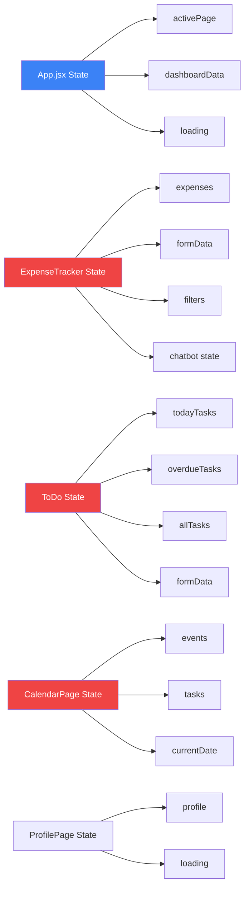

### State Distribution

#### App.jsx (Root Level)
```javascript
const [activePage, setActivePage] = useState('Dashboard');
const [dashboardData, setDashboardData] = useState(null);
const [loading, setLoading] = useState(true);
```

**Issues:**
- Page navigation state is tightly coupled to App component
- No persistent routing (page refresh loses state)
- Dashboard data is fetched but uses dummy data

#### ExpenseTracker.jsx (1300+ lines)
```javascript
// Multiple state variables managing different concerns
const [expenses, setExpenses] = useState([]);
const [formData, setFormData] = useState({...});
const [editingExpense, setEditingExpense] = useState(null);
const [selectedMonth, setSelectedMonth] = useState(new Date());
const [categoryFilter, setCategoryFilter] = useState('all');
const [searchQuery, setSearchQuery] = useState('');
const [showChatbot, setShowChatbot] = useState(false);
const [chatMessages, setChatMessages] = useState([]);
const [isRecording, setIsRecording] = useState(false);
// ... 20+ more state variables
```

**Issues:**
- Massive component with too many responsibilities
- State scattered across 20+ useState calls
- No separation between UI state and data state
- Difficult to test and maintain

#### ToDo.jsx (500+ lines)
```javascript
const [activeTab, setActiveTab] = useState('today');
const [todayTasks, setTodayTasks] = useState([]);
const [overdueTasks, setOverdueTasks] = useState([]);
const [allTasks, setAllTasks] = useState([]);
const [selectedTask, setSelectedTask] = useState(null);
const [editingTask, setEditingTask] = useState(null);
const [formData, setFormData] = useState({...});
```

**Issues:**
- Duplicate task arrays for different views
- No shared state with Dashboard (which also displays tasks)
- Refetches data on every tab change

#### CalendarPage.jsx
```javascript
const [currentDate, setCurrentDate] = useState(new Date());
const [events, setEvents] = useState([]);
const [tasks, setTasks] = useState([]);
const [modalDate, setModalDate] = useState(null);
const [showAddModal, setShowAddModal] = useState(false);
```

**Issues:**
- Events and tasks are isolated from other components
- No synchronization with Dashboard or ToDo components

### State Management Problems

1. **No Single Source of Truth**
   - Tasks are fetched separately in ToDo, Dashboard, and Calendar
   - Expenses are only in ExpenseTracker
   - No data sharing between components

2. **Prop Drilling**
   - `activePage` and `setActivePage` passed from App → Sidebar
   - Dashboard data passed from App → Dashboard

3. **No State Persistence**
   - All state is lost on page refresh
   - No localStorage or sessionStorage usage

4. **Redundant API Calls**
   - Each component independently fetches its data
   - No caching mechanism
   - Dashboard widgets make separate API calls

5. **No Optimistic Updates**
   - All operations wait for server response
   - Poor perceived performance

---

## Data Flow

### Current Data Flow Pattern

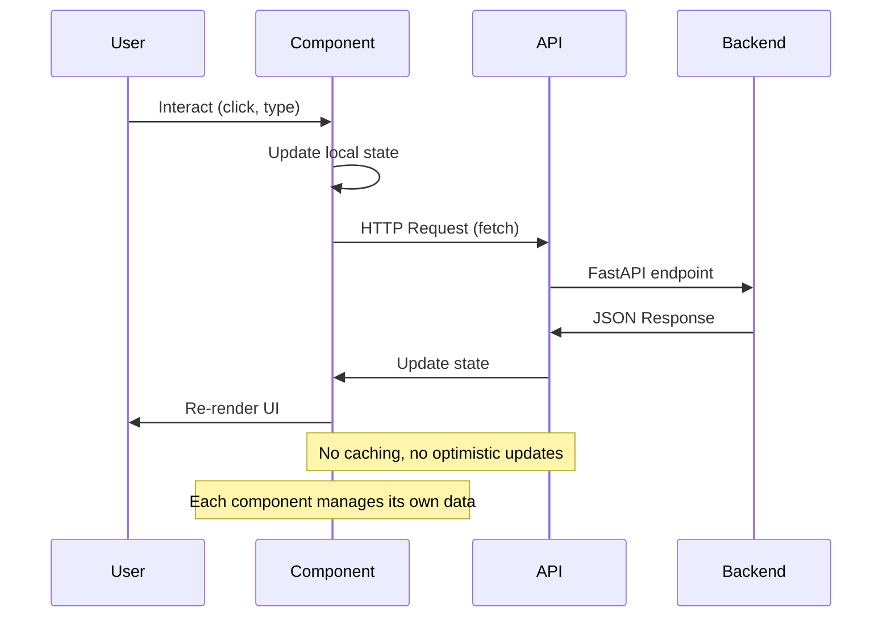

### API Call Pattern (Repeated in Every Component)

```javascript
// Pattern repeated in ExpenseTracker, ToDo, Calendar, Profile, Dashboard widgets
const fetchData = async () => {
  setLoading(true);
  try {
    const response = await fetch(`${BASE_URL}/endpoint`);
    const data = await response.json();
    setState(data);
  } catch (error) {
    console.error('Error:', error);
  } finally {
    setLoading(false);
  }
};
```

**Issues:**
- Hardcoded BASE_URL in every component
- Inconsistent error handling
- No request/response interceptors
- No authentication token management
- No retry logic
- No loading state coordination

### Data Flow Issues

1. **Unidirectional but Disconnected**
   - Data flows down within each component tree
   - No cross-component communication
   - Sibling components can't share data

2. **No Event System**
   - Creating an expense doesn't update Dashboard
   - Completing a task doesn't update Calendar
   - No pub/sub or event bus

3. **Manual Synchronization**
   - Components must manually refetch after mutations
   - No automatic cache invalidation


---

## Routing & Navigation

### Current Implementation: **Manual State-Based Routing**

The application uses a **custom state-based routing system** instead of React Router.

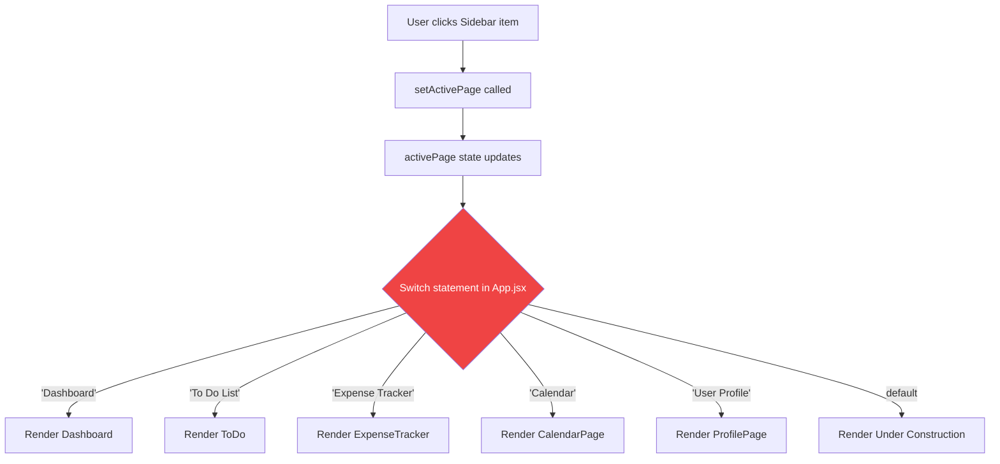

### Implementation in App.jsx

```javascript
function App() {
  const [activePage, setActivePage] = useState('Dashboard');
  
  const renderPage = () => {
    switch (activePage) {
      case 'Dashboard':
        return <Dashboard data={dashboardData} />;
      case 'User Profile':
        return <ProfilePage />;
      case 'To Do List':
        return <ToDo />;
      case 'Calendar':
        return <CalendarPage />;
      case 'Expense Tracker':
        return <ExpenseTracker />;
      default:
        return <div>Under construction</div>;
    }
  };
  
  return (
    <div className="app-container">
      <Sidebar activePage={activePage} setActivePage={setActivePage} />
      <div className="content-area">
        {loading ? <div>Loading...</div> : renderPage()}
      </div>
    </div>
  );
}
```

### Navigation Issues

1. **No URL Routing**
   - Browser URL doesn't change when navigating
   - Can't bookmark specific pages
   - Can't use browser back/forward buttons
   - Can't share links to specific pages

2. **No Route Guards**
   - No authentication checks
   - No protected routes
   - No redirect logic

3. **No Lazy Loading**
   - All page components loaded upfront
   - Larger initial bundle size
   - Slower initial page load

4. **State Loss on Refresh**
   - Refreshing always returns to Dashboard
   - No route persistence

5. **No Nested Routes**
   - Can't have sub-pages or tabs with URLs
   - No route parameters (e.g., `/expense/:id`)

### Recommended Solution

Replace with **React Router v6**:

```javascript
// Proposed structure
<BrowserRouter>
  <Routes>
    <Route path="/" element={<Layout />}>
      <Route index element={<Dashboard />} />
      <Route path="tasks" element={<ToDo />} />
      <Route path="expenses" element={<ExpenseTracker />} />
      <Route path="calendar" element={<CalendarPage />} />
      <Route path="profile" element={<ProfilePage />} />
    </Route>
  </Routes>
</BrowserRouter>
```

---

## API Integration

### Current Approach: **Direct Fetch Calls**

Every component makes direct `fetch()` calls to the backend API.

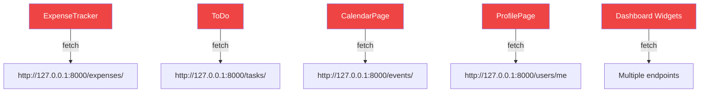

### API Configuration Issues

#### 1. Hardcoded Base URLs (Inconsistent)

```javascript
// ExpenseTracker.jsx
const BASE_URL = process.env.VITE_BASE_URL || 'http://localhost:8000';

// ToDo.jsx
const baseURL = "http://127.0.0.1:8000";

// CalendarPage.jsx
const BASE_URL = 'http://127.0.0.1:8000';

// ProfilePage.jsx
const BASE_URL = 'http://127.0.0.1:8000';
```

**Problems:**
- Inconsistent naming (BASE_URL vs baseURL)
- Different default values (localhost vs 127.0.0.1)
- Environment variable only used in one component
- Must update multiple files to change API URL

#### 2. No Centralized API Client

Each component implements its own fetch logic:

```javascript
// Repeated pattern across 5+ components
const fetchData = async () => {
  setLoading(true);
  try {
    const response = await fetch(`${BASE_URL}/endpoint`);
    if (!response.ok) throw new Error('Failed');
    const data = await response.json();
    setData(data);
  } catch (error) {
    console.error(error);
    setError(error.message);
  } finally {
    setLoading(false);
  }
};
```

#### 3. No Request/Response Interceptors

- No global error handling
- No authentication token injection
- No request logging
- No response transformation

#### 4. Inconsistent Error Handling

```javascript
// Some components
catch (error) {
  console.error('Error:', error);
}

// Other components
catch (error) {
  console.error('Error:', error);
  setMessage('Error fetching data');
}

// Others
catch (error) {
  console.error('Error:', error);
  alert(`Error: ${error.message}`);
}
```

#### 5. No Caching Strategy

- Every component refetches data on mount
- No cache invalidation
- No stale-while-revalidate
- Dashboard makes 10+ API calls on load

### API Endpoints Used

| Component | Endpoints |
|-----------|-----------|
| **ExpenseTracker** | `GET /expenses/`<br>`POST /expenses/`<br>`PUT /expenses/{id}`<br>`DELETE /expenses/{id}`<br>`POST /expenses/ai/parse-text`<br>`POST /expenses/ai/parse-receipt`<br>`POST /expenses/ai/parse-voice` |
| **ToDo** | `GET /tasks/today`<br>`GET /tasks/overdue`<br>`GET /tasks/`<br>`POST /tasks/`<br>`PUT /tasks/{id}`<br>`DELETE /tasks/{id}` |
| **CalendarPage** | `GET /events/calendar/{year}/{month}`<br>`GET /tasks?start_date=&end_date=`<br>`POST /events/`<br>`PUT /events/{id}`<br>`DELETE /events/{id}` |
| **ProfilePage** | `GET /users/me`<br>`PUT /users/me`<br>`POST /users/me/avatar` |
| **Dashboard** | Multiple endpoints from all features |


---

## Styling Architecture

### Current Approach: **Hybrid Tailwind + Custom CSS**

The application uses a combination of:
1. **Tailwind CSS** utility classes
2. **Custom CSS** classes in `index.css`
3. **Inline styles** (occasionally)

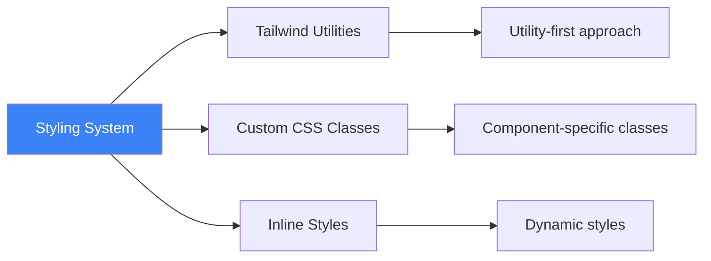

### Tailwind Configuration

```javascript
// tailwind.config.js
module.exports = {
  content: [
    "./index.html",
    "./src/**/*.{js,ts,jsx,tsx}"
  ],
  theme: {
    extend: {},  // No custom theme extensions
  },
  plugins: [],   // No plugins
}
```

**Observations:**
- Minimal Tailwind configuration
- No custom colors, fonts, or spacing
- No design tokens
- No Tailwind plugins (forms, typography, etc.)

### Custom CSS Structure

```css
/* index.css - 1000+ lines */

/* 1. Tailwind Directives */
@tailwind base;
@tailwind components;
@tailwind utilities;

/* 2. Global Styles */
body { ... }

/* 3. Layout Classes */
.app-container { ... }
.content-area { ... }

/* 4. Component-Specific Classes */
.sidebar { ... }
.sidebar-title { ... }
.sidebar-nav-item { ... }

.dashboard-main { ... }
.dashboard-header { ... }
.metric-cards-grid { ... }

/* 5. Feature-Specific Classes */
.expense-tracker { ... }
.todo-container { ... }
.calendar-grid { ... }
```

### Styling Patterns

#### 1. **Tailwind Utilities in JSX**
```jsx
<div className="flex items-center gap-4 p-6 bg-white rounded-lg shadow-md">
  <button className="px-4 py-2 bg-blue-500 text-white rounded hover:bg-blue-600">
    Click me
  </button>
</div>
```

#### 2. **Custom CSS Classes**
```jsx
<aside className="sidebar">
  <h1 className="sidebar-title">Dashboard</h1>
  <nav className="sidebar-nav">
    <button className="sidebar-nav-item sidebar-nav-item-active">
      Dashboard
    </button>
  </nav>
</aside>
```

#### 3. **Mixed Approach**
```jsx
<div className="dashboard-tile">
  <div className="flex justify-between items-center mb-4">
    <h3 className="text-xl font-bold">Expenses</h3>
  </div>
</div>
```

### Styling Issues

1. **Inconsistent Approach**
   - Some components use Tailwind exclusively
   - Others use custom CSS classes
   - No clear guidelines on when to use which

2. **No Design System**
   - Colors hardcoded throughout (no theme)
   - Inconsistent spacing and sizing
   - No reusable component styles

3. **Large CSS File**
   - `index.css` is 1000+ lines
   - Difficult to maintain
   - No CSS modules or scoped styles

4. **No Component Library**
   - Buttons styled differently across components
   - Inputs have inconsistent styling
   - Modals implemented differently

5. **Responsive Design**
   - Limited responsive utilities
   - No mobile-first approach
   - Fixed widths in many places

### Color Palette (Extracted from CSS)

```css
/* Primary Colors */
--blue-500: #3b82f6
--blue-600: #2563eb
--blue-700: #1d4ed8

/* Gray Scale */
--gray-50: #f9fafb
--gray-100: #f3f4f6
--gray-200: #e5e7eb
--gray-600: #6b7280
--gray-800: #1f2937

/* Semantic Colors */
--red-500: #ef4444 (error/delete)
--green-500: #10b981 (success)
--yellow-500: #f59e0b (warning)
```

**Issue:** Colors are not defined as CSS variables or Tailwind theme, leading to inconsistency.

---

## Current Design Patterns

### Identified Patterns

#### 1. **Component Composition** ✅
```javascript
// Dashboard composes multiple smaller components
<Dashboard>
  <MetricCard />
  <DashboardTotalExpense />
  <TasksAndEvents />
  <ExpenseDashboard />
</Dashboard>
```

**Status:** Well implemented for Dashboard

#### 2. **Controlled Components** ✅
```javascript
// Form inputs controlled by state
<input
  value={formData.title}
  onChange={(e) => setFormData({...formData, title: e.target.value})}
/>
```

**Status:** Consistently used across all forms

#### 3. **Conditional Rendering** ✅
```javascript
{loading ? (
  <div>Loading...</div>
) : (
  <ExpenseList expenses={expenses} />
)}
```

**Status:** Used throughout the application

#### 4. **Props Drilling** ❌
```javascript
// App.jsx
<Sidebar activePage={activePage} setActivePage={setActivePage} />

// Sidebar.jsx
function Sidebar({ activePage, setActivePage }) {
  // Uses both props
}
```

**Issue:** State and setters passed through props instead of using Context

#### 5. **Inline Event Handlers** ⚠️
```javascript
// Creates new function on every render
<button onClick={() => handleDelete(expense.id)}>Delete</button>
```

**Issue:** Performance impact, should use useCallback

#### 6. **useEffect for Data Fetching** ✅
```javascript
useEffect(() => {
  fetchExpenses();
}, []);
```

**Status:** Standard pattern, but could be improved with React Query

#### 7. **Monolithic Components** ❌
```javascript
// ExpenseTracker.jsx - 1300+ lines
// - State management
// - API calls
// - Form handling
// - UI rendering
// - Modal logic
// - Chatbot logic
```

**Issue:** Violates Single Responsibility Principle

### Missing Patterns

1. **Custom Hooks** - No reusable logic extraction
2. **Context API** - No global state management
3. **Higher-Order Components** - No cross-cutting concerns
4. **Render Props** - No flexible component composition
5. **Compound Components** - No complex component APIs
6. **Service Layer** - No API abstraction
7. **Error Boundaries** - No error handling at component level
8. **Lazy Loading** - No code splitting
9. **Memoization** - No React.memo, useMemo, useCallback optimization


---

## Technology Stack

### Core Dependencies

```json
{
  "react": "^19.1.0",
  "react-dom": "^19.1.0",
  "react-scripts": "5.0.1"
}
```

### UI & Styling

```json
{
  "tailwindcss": "^3.4.17",
  "postcss": "^8.5.6",
  "autoprefixer": "^10.4.21",
  "lucide-react": "^0.525.0",
  "react-icons": "^5.5.0"
}
```

### Data Visualization

```json
{
  "recharts": "^3.0.0"
}
```

### HTTP Client

```json
{
  "axios": "^1.10.0"
}
```

**Note:** Axios is installed but not used. All API calls use native `fetch()`.

### Media Processing

```json
{
  "@ffmpeg/ffmpeg": "^0.12.15"
}
```

**Usage:** Audio processing in ExpenseTracker for voice-to-text feature.

### Testing

```json
{
  "@testing-library/react": "^16.3.0",
  "@testing-library/jest-dom": "^6.6.3",
  "@testing-library/user-event": "^13.5.0"
}
```

**Note:** Testing libraries installed but no test files found.

### Build Tool

- **Create React App (CRA)** - react-scripts 5.0.1
- Webpack (bundled with CRA)
- Babel (bundled with CRA)

### Missing Dependencies

Recommended additions:
- `react-router-dom` - Client-side routing
- `@tanstack/react-query` - Data fetching & caching
- `zustand` or `jotai` - Lightweight state management
- `react-hook-form` - Form management
- `zod` - Schema validation
- `date-fns` or `dayjs` - Date manipulation

---

## Identified Issues

### 1. Architecture Issues

| Issue | Severity | Impact |
|-------|----------|--------|
| No routing library | 🔴 High | Poor UX, no bookmarking, no deep linking |
| No state management | 🔴 High | Data duplication, no single source of truth |
| Monolithic components | 🔴 High | Hard to maintain, test, and reuse |
| No service layer | 🟡 Medium | API logic scattered, hard to mock |
| No custom hooks | 🟡 Medium | Logic duplication across components |
| No error boundaries | 🟡 Medium | Poor error handling, app crashes |
| No lazy loading | 🟢 Low | Larger bundle, slower initial load |

### 2. State Management Issues

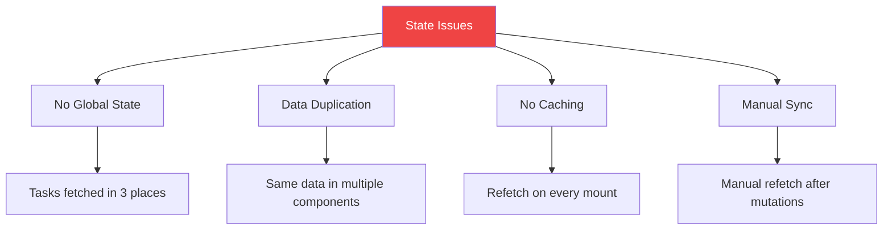

**Specific Problems:**
- Tasks fetched separately in ToDo, Dashboard, and Calendar
- No synchronization between components
- Creating a task doesn't update Dashboard
- Completing a task doesn't update Calendar
- No optimistic updates

### 3. Component Issues

| Component | Lines | Issues |
|-----------|-------|--------|
| ExpenseTracker.jsx | 1300+ | Too large, mixed concerns, hard to test |
| ToDo.jsx | 500+ | Duplicate state, complex logic |
| App.jsx | 100+ | Manual routing, tight coupling |
| CalendarPage.jsx | 300+ | Complex date logic, no abstraction |

### 4. API Integration Issues

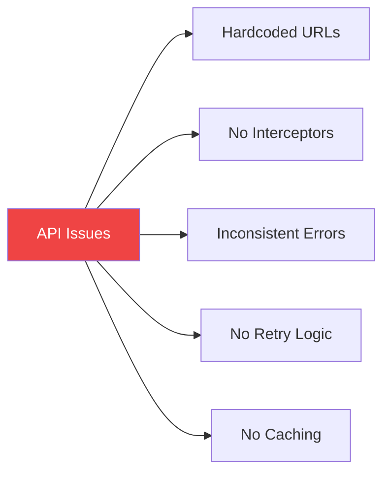

**Impact:**
- Difficult to change API URL
- No global error handling
- Poor user experience on network errors
- Unnecessary API calls

### 5. Performance Issues

1. **No Code Splitting**
   - All components loaded upfront
   - Large initial bundle size

2. **No Memoization**
   - Components re-render unnecessarily
   - Expensive calculations repeated

3. **Inline Functions**
   - New functions created on every render
   - Child components re-render unnecessarily

4. **No Virtual Scrolling**
   - Large lists (expenses, tasks) render all items
   - Performance degrades with many items

### 6. Developer Experience Issues

1. **No TypeScript**
   - No type safety
   - Harder to refactor
   - More runtime errors

2. **No Linting Configuration**
   - Inconsistent code style
   - Potential bugs not caught

3. **No Testing**
   - Testing libraries installed but unused
   - No unit or integration tests

4. **No Documentation**
   - No component documentation
   - No API documentation
   - No architecture documentation (until now)

### 7. Security Issues

1. **No Authentication**
   - No login/logout functionality
   - No token management
   - API calls don't include auth headers

2. **No Input Validation**
   - Client-side validation minimal
   - No schema validation

3. **No CSRF Protection**
   - No CSRF tokens in forms

---

## Architecture Diagrams

### Current Component Communication

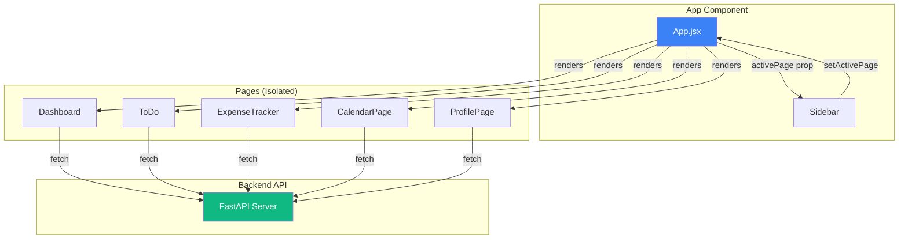

**Key Observation:** No communication between page components. Each is an isolated island.


### Current Data Flow Architecture

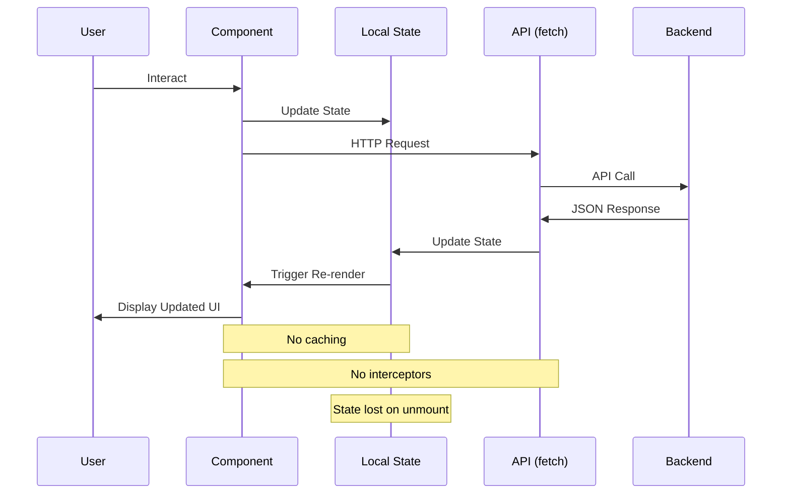

### Expense Tracker Internal Architecture

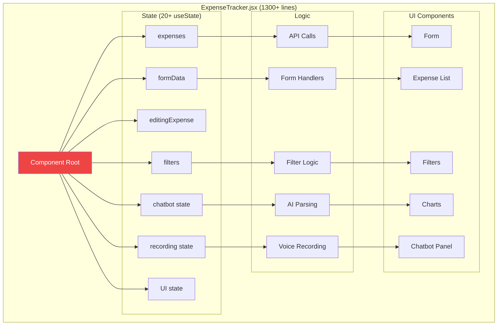

**Issue:** Everything is tightly coupled in one massive component.

### Dashboard Data Dependencies

```mermaid
graph LR
    A[Dashboard] --> B[DashboardTotalExpense]
    A --> C[DashboardTaskCompletion]
    A --> D[DashboardConsistency]
    A --> E[DashboardUpcomingEvents]
    A --> F[TasksAndEvents]
    A --> G[TaskHeatmap]
    A --> H[ExpenseDashboard]
    A --> I[ExpenseInsights]
    
    B -->|fetch| J[/expenses/]
    C -->|fetch| K[/tasks/]
    E -->|fetch| L[/events/]
    F -->|fetch| M[/tasks/ + /events/]
    G -->|fetch| N[/tasks/]
    H -->|fetch| O[/expenses/]
    I -->|fetch| P[/expenses/ai/insights]
    
    style A fill:#3b82f6,color:#fff
    style J fill:#ef4444,color:#fff
    style K fill:#ef4444,color:#fff
    style L fill:#ef4444,color:#fff
    style M fill:#ef4444,color:#fff
    style N fill:#ef4444,color:#fff
    style O fill:#ef4444,color:#fff
    style P fill:#ef4444,color:#fff
```

**Issue:** Dashboard makes 7+ separate API calls on mount. No data sharing between widgets.

### Proposed Improved Architecture

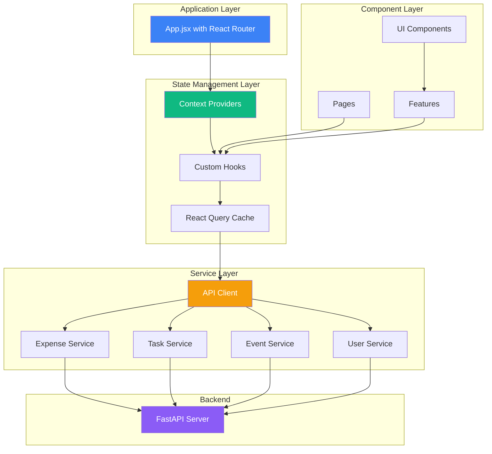

### File Structure Comparison

#### Current Structure
```
src/
├── components/
│   ├── CalendarPage/
│   ├── dashboard/
│   ├── expenseTrack/
│   ├── ToDoList/
│   └── profile/
├── pages/
├── App.jsx
├── index.js
└── index.css
```

#### Recommended Structure
```
src/
├── components/          # Reusable UI components
│   ├── ui/             # Button, Input, Modal, Card, etc.
│   ├── forms/          # Form components
│   └── layout/         # Layout components
├── features/           # Feature modules
│   ├── expenses/
│   │   ├── components/
│   │   ├── hooks/
│   │   ├── services/
│   │   └── types/
│   ├── tasks/
│   ├── events/
│   ├── dashboard/
│   └── profile/
├── pages/              # Page components
│   ├── DashboardPage.jsx
│   ├── ExpensesPage.jsx
│   ├── TasksPage.jsx
│   └── CalendarPage.jsx
├── hooks/              # Shared custom hooks
├── services/           # API services
│   ├── api.js
│   ├── expenseService.js
│   ├── taskService.js
│   └── eventService.js
├── contexts/           # React contexts
│   ├── AppContext.jsx
│   └── AuthContext.jsx
├── utils/              # Utility functions
├── types/              # TypeScript types (future)
├── App.jsx
├── index.js
└── styles/
    ├── index.css
    └── tailwind.css
```

---

## Summary & Recommendations

### Current State Summary

**Strengths:**
- ✅ Working application with core features
- ✅ Clean component composition in Dashboard
- ✅ Consistent use of React hooks
- ✅ Modern UI with Tailwind CSS
- ✅ Feature-based folder organization

**Weaknesses:**
- ❌ No routing library (manual state-based routing)
- ❌ No global state management
- ❌ Monolithic components (1300+ lines)
- ❌ No API abstraction layer
- ❌ No custom hooks for reusable logic
- ❌ Hardcoded API URLs in every component
- ❌ No error boundaries
- ❌ No code splitting or lazy loading
- ❌ No testing implementation
- ❌ No TypeScript

### Priority Recommendations

#### 🔴 Critical (Do First)

1. **Implement React Router**
   - Replace manual routing with React Router v6
   - Add URL-based navigation
   - Enable deep linking and bookmarking

2. **Create Service Layer**
   - Centralize all API calls
   - Create `services/api.js` with base configuration
   - Create feature-specific services (expenseService, taskService, etc.)

3. **Extract Custom Hooks**
   - Create `useExpenses`, `useTasks`, `useEvents` hooks
   - Move data fetching logic out of components
   - Enable logic reuse across components

4. **Refactor Large Components**
   - Split ExpenseTracker (1300 lines) into smaller components
   - Split ToDo (500 lines) into smaller components
   - Apply Single Responsibility Principle

#### 🟡 Important (Do Next)

5. **Implement Context API**
   - Create AppContext for global state
   - Share data between components
   - Eliminate prop drilling

6. **Add React Query**
   - Implement caching for API calls
   - Add optimistic updates
   - Reduce redundant API calls

7. **Build UI Component Library**
   - Create reusable Button, Input, Modal components
   - Implement compound component pattern
   - Establish design system

8. **Add Error Boundaries**
   - Catch and handle component errors
   - Improve error UX
   - Add error logging

#### 🟢 Nice to Have (Do Later)

9. **Add TypeScript**
   - Migrate to TypeScript for type safety
   - Reduce runtime errors
   - Improve developer experience

10. **Implement Testing**
    - Write unit tests for hooks and services
    - Write integration tests for features
    - Set up CI/CD with test automation

11. **Performance Optimization**
    - Add lazy loading for routes
    - Implement React.memo for expensive components
    - Add virtual scrolling for large lists

12. **Add Authentication**
    - Implement login/logout
    - Add protected routes
    - Manage auth tokens

---

## Next Steps

1. **Review this document** with the team
2. **Prioritize refactoring tasks** based on business needs
3. **Create implementation plan** with timeline
4. **Start with service layer** (quick win, high impact)
5. **Gradually refactor** one feature at a time
6. **Document patterns** as you implement them

---

## References

- [React Documentation](https://react.dev/)
- [React Router Documentation](https://reactrouter.com/)
- [TanStack Query (React Query)](https://tanstack.com/query/latest)
- [Tailwind CSS Documentation](https://tailwindcss.com/)
- [Design Patterns Suggestions](./design-patterns-suggestions.md)

---

**Document Version:** 1.0  
**Last Updated:** November 11, 2025  
**Author:** Architecture Analysis  
**Status:** Current State Documentation
