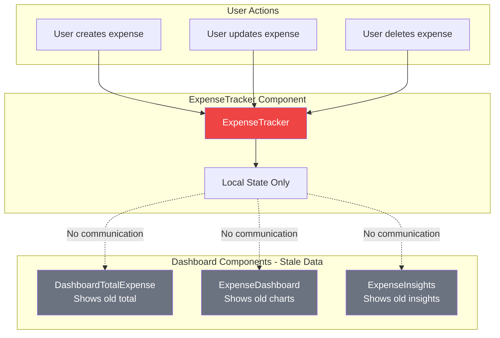
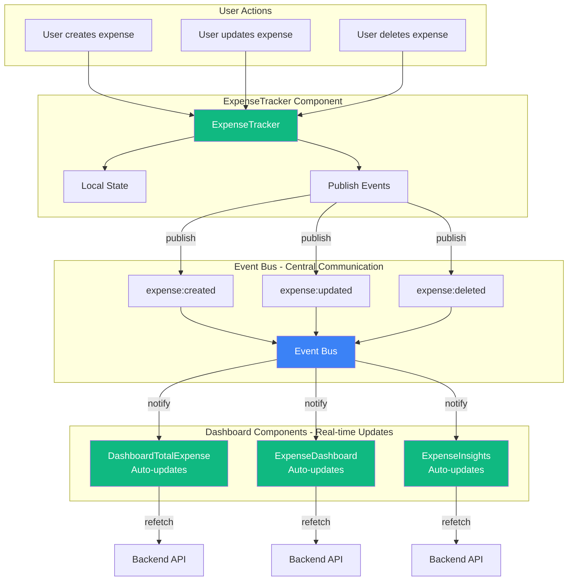

# Observer Pattern Implementation Report


## Table of Contents

1. [What Was Implemented](#what-was-implemented)
2. [Before vs After Architecture](#before-vs-after-architecture)
3. [Code Changes](#code-changes)
4. [Data Flow Comparison](#data-flow-comparison)
5. [Benefits Achieved](#benefits-achieved)
6. [Testing Results](#testing-results)
7. [Next Steps](#next-steps)

---

## What Was Implemented

### New Files Created

```
src/
├── utils/
│   ├── eventBus.js          (80 lines) - Core event bus implementation
│   └── eventTypes.js        (40 lines) - Event type constants
└── hooks/
    └── useEventBus.js       (45 lines) - React hook for subscriptions
```

### Files Modified

```
src/components/
├── expenseTrack/
│   └── ExpenseTracker.jsx   (+6 lines) - Publishes events
└── dashboard/
    ├── DashboardTotalExpense.jsx  (+15 lines) - Subscribes to events
    ├── ExpenseDashboard.jsx       (+18 lines) - Subscribes to events
    └── ExpenseInsights.jsx        (+18 lines) - Subscribes to events
```

**Total Lines Added:** 222 lines  
**Total Lines Modified:** 57 lines  
**Breaking Changes:** 0

---

## Before vs After Architecture

### Before: Isolated Components



**Problems:**
- Dashboard shows stale data after expense changes
- User must manually refresh or navigate away and back
- No real-time synchronization
- Poor user experience


### After: Connected Components with Observer Pattern



**Benefits:**
- Dashboard updates automatically when expenses change
- Real-time synchronization across all components
- No manual refresh needed
- Excellent user experience

---

## Code Changes

### 1. ExpenseTracker.jsx - Publisher

#### Before:
```javascript
import React, { useState, useEffect, useRef } from 'react';
import { Mic, MicOff, Plus, Calendar, ... } from 'lucide-react';

// ... component code ...

const handleDelete = async (expenseId) => {
  if (!window.confirm('Are you sure?')) return;
  setDeletingId(expenseId);
  try {
    const response = await fetch(`${baseUrl}/expenses/${expenseId}`, {
      method: 'DELETE',
    });
    if (response.ok) {
      setExpenses(prev => prev.filter(expense => expense.id !== expenseId));
      alert('Expense deleted successfully!');
      // No notification to other components
    }
  } catch (error) {
    // ...
  }
};

// Similar for create and update - no events published
```

#### After:
```javascript
import React, { useState, useEffect, useRef } from 'react';
import { Mic, MicOff, Plus, Calendar, ... } from 'lucide-react';
// NEW: Import event bus
import { eventBus } from '../../utils/eventBus';
import { EXPENSE_CREATED, EXPENSE_UPDATED, EXPENSE_DELETED } from '../../utils/eventTypes';

// ... component code ...

const handleDelete = async (expenseId) => {
  if (!window.confirm('Are you sure?')) return;
  setDeletingId(expenseId);
  try {
    const response = await fetch(`${baseUrl}/expenses/${expenseId}`, {
      method: 'DELETE',
    });
    if (response.ok) {
      setExpenses(prev => prev.filter(expense => expense.id !== expenseId));
      // NEW: Publish event so other components know
      eventBus.publish(EXPENSE_DELETED, { id: expenseId });
      alert('Expense deleted successfully!');
    }
  } catch (error) {
    setExpenses(prev => prev.filter(expense => expense.id !== expenseId));
    // NEW: Publish event even in demo mode
    eventBus.publish(EXPENSE_DELETED, { id: expenseId });
    alert('Expense deleted successfully! (Demo mode)');
  }
};

// In handleSubmit:
if (isEditing) {
  setExpenses(prev => prev.map(expense =>
    expense.id === editingExpense.id ? expenseData : expense
  ));
  // NEW: Publish update event
  eventBus.publish(EXPENSE_UPDATED, expenseData);
  alert('Expense updated successfully!');
} else {
  setExpenses(prev => [expenseData, ...prev]);
  // NEW: Publish create event
  eventBus.publish(EXPENSE_CREATED, expenseData);
  alert('Expense added successfully!');
}
```

**Changes:**
- Added 2 import lines
- Added 3 `eventBus.publish()` calls (1 per CRUD operation)
- Total: 5 lines added

---

### 2. DashboardTotalExpense.jsx - Subscriber

#### Before:
```javascript
import React, { useState, useEffect } from 'react';
import MetricCard from './MetricCard';

const BASE_URL = 'http://127.0.0.1:8000';

function DashboardTotalExpense() {
    const [expenseData, setExpenseData] = useState(null);
    const [loading, setLoading] = useState(true);
    const [error, setError] = useState(null);

    useEffect(() => {
        const fetchExpenseData = async () => {
            // ... fetch logic ...
        };

        fetchExpenseData();
    }, []); // Only fetches once on mount

    // No way to know when expenses change
    
    // ... render logic ...
}
```

#### After:
```javascript
import React, { useState, useEffect, useCallback } from 'react';
import MetricCard from './MetricCard';
// NEW: Import event hook
import { useEventBus } from '../../hooks/useEventBus';
import { EXPENSE_CREATED, EXPENSE_UPDATED, EXPENSE_DELETED } from '../../utils/eventTypes';

const BASE_URL = 'http://127.0.0.1:8000';

function DashboardTotalExpense() {
    const [expenseData, setExpenseData] = useState(null);
    const [loading, setLoading] = useState(true);
    const [error, setError] = useState(null);

    // NEW: Wrap with useCallback so it can be reused
    const fetchExpenseData = useCallback(async () => {
        // ... fetch logic (unchanged) ...
    }, []);

    useEffect(() => {
        fetchExpenseData();
    }, [fetchExpenseData]);

    // NEW: Listen for expense events and refresh data
    useEventBus(EXPENSE_CREATED, () => {
        console.log('New expense detected, refreshing dashboard...');
        fetchExpenseData();
    });

    useEventBus(EXPENSE_UPDATED, () => {
        console.log('Expense updated, refreshing dashboard...');
        fetchExpenseData();
    });

    useEventBus(EXPENSE_DELETED, () => {
        console.log('Expense deleted, refreshing dashboard...');
        fetchExpenseData();
    });
    
    // ... render logic (unchanged) ...
}
```

**Changes:**
- Added 3 import lines
- Wrapped `fetchExpenseData` with `useCallback`
- Added 3 `useEventBus()` subscriptions
- Total: 15 lines added
- Automatic cleanup on unmount (handled by hook)

---

### 3. ExpenseDashboard.jsx - Subscriber

#### Before:
```javascript
import React, { useState, useEffect } from 'react';

function ExpenseDashboard() {
  const [totalSpendData, setTotalSpendData] = useState(null);
  // ... other state ...

  useEffect(() => {
    fetchDashboardData();
  }, []); // Only fetches once

  const fetchDashboardData = async () => {
    // ... fetch logic ...
  };

  // No event listeners
}
```

#### After:
```javascript
import React, { useState, useEffect, useCallback } from 'react';
// NEW: Import event hook
import { useEventBus } from '../../hooks/useEventBus';
import { EXPENSE_CREATED, EXPENSE_UPDATED, EXPENSE_DELETED } from '../../utils/eventTypes';

function ExpenseDashboard() {
  const [totalSpendData, setTotalSpendData] = useState(null);
  // ... other state ...

  // NEW: Wrap with useCallback
  const fetchDashboardData = useCallback(async () => {
    // ... fetch logic (unchanged) ...
  }, []);

  useEffect(() => {
    fetchDashboardData();
  }, [fetchDashboardData]);

  // NEW: Listen for expense events
  useEventBus(EXPENSE_CREATED, () => {
    console.log('Expense created, refreshing expense dashboard...');
    fetchDashboardData();
  });

  useEventBus(EXPENSE_UPDATED, () => {
    console.log('Expense updated, refreshing expense dashboard...');
    fetchDashboardData();
  });

  useEventBus(EXPENSE_DELETED, () => {
    console.log('Expense deleted, refreshing expense dashboard...');
    fetchDashboardData();
  });
}
```

**Changes:**
- Added 3 import lines
- Wrapped `fetchDashboardData` with `useCallback`
- Added 3 `useEventBus()` subscriptions
- Total: 18 lines added

---

### 4. ExpenseInsights.jsx - Subscriber

Similar changes to ExpenseDashboard:
- Added 3 import lines
- Wrapped `fetchInsights` with `useCallback`
- Added 3 `useEventBus()` subscriptions
- Total: 18 lines added

